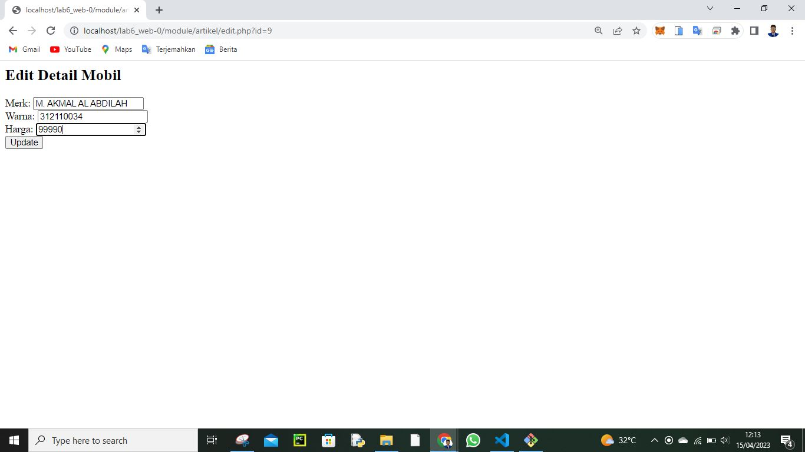

# Lab6_Web

## Profil
| #               | Biodata                      |
| --------------- | ---------------------------- |
| **Nama**        | M. AKMAL AL ABDILAH          |
| **NIM**         | 312110034                    |
| **Kelas**       | TI.21.A.1                    |
| **Mata Kuliah** | Pemrograman Web 2            |

Assalam'mulaikum Kembali lagi dengan saya di tugas peratikum kali ini 
Saya akan memberikan praktik memalui hasil run dari gambar kalian bisa jika benasaran bisa langsung mendownload file coding dan coba sendiri kodingnya.

Praktikum 6: OOP Lanjutan
• Copy file library (class) dari praktikum 5 dan letakkan pada folder 
class.
• Buat file template yang berisi template dan css untuk header, footer 
dan menu sidebar.
• Buat modul artikel yang berisi CRUD dengan memanfaatkan library 
database dan form tersbut.
• File index.php berisi proses routing aplikasi dan dikombinasikan
dengan penggunaan mod_rewrite pada file .htaccess

Home

Tambah

Edit

Hapus

Jadi kali ini saya hanya mengeksekusi kode aja jika kalian ingin penjelasan bisa cari di flatfom lain kutang lebi saya ucapkan!

